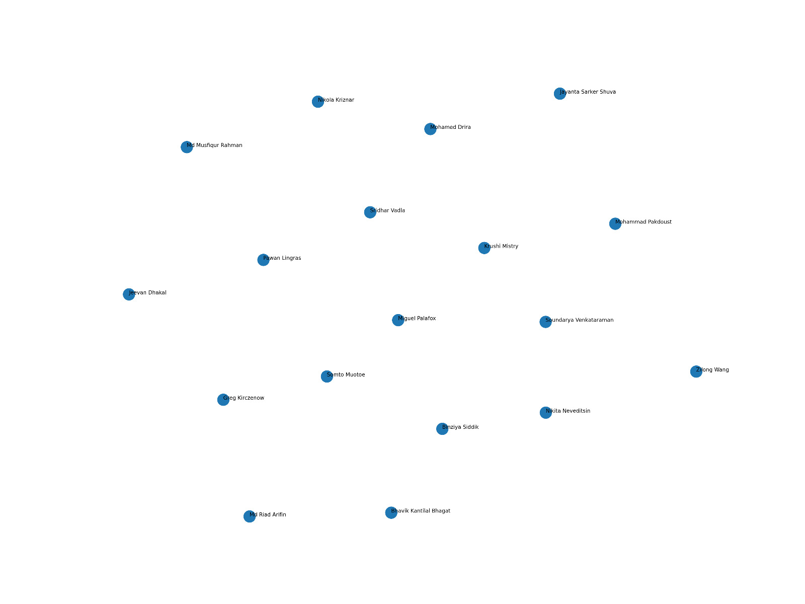

## What Are Embeddings?

Have you ever wondered how a computer understands that "happy" and "joyful" represent similar feelings? To a computer, words are just strings of letters. To give them meaning, we use **embeddings**. Think of an embedding as a unique conceptual "ID card" for a text, consisting of a list of numbers that act like coordinates on a giant map. On this map, ideas with similar meanings land close together, while unrelated ones are far apart. For example, in our `classmates.csv` analysis, **Jeevan Dhakal**'s interest in "watching movies" was changed to "viewing films". Even though the words are different, the embedding model places them in almost the exact same spot on the map because they share the same meaning. Conversely, when we changed **Miguel Palafox**'s description from "enjoying" to "detesting" activities, the embedding moved to a completely different area, reflecting the drastic change in sentiment. This powerful ability allows us to map and visualize the shared interests within our class effectively.

## Data Analysis

To test embedding sensitivity to semantic changes, I modified three classmate descriptions:
1. **Miguel Palafox**: Changed "enjoy" and other positive verbs to "detest" (Major semantic inversion).
2. **Nikita Neveditsin**: Added a distinct clause about "avoiding my family at all costs" (Context addition).
3. **Jeevan Dhakal**: Rephrased existing hobbies, e.g., changing "watching movies" to "viewing films" (Phrasing change).

**Impact Analysis:**
The results showed varying degrees of impact on the embeddings:
*   **Miguel Palafox** experienced a large drop in cosine similarity (**0.548**). This drastic change confirms that the model effectively captured the complete inversion of sentiment from positive to negative.
*   **Nikita Neveditsin** showed a moderate drop (**0.836**), reflecting the introduction of completely new information while maintaining the original context.
*   **Jeevan Dhakal** retained a relatively high similarity (**0.862**). Even though the specific words changed, the semantic proximity of terms like "films" vs "movies" kept the vector close to the original.

These results suggest that the embeddings are robust to widely varying phrasing but are appropriately sensitive to strong sentiment inversions and the injection of new context.

## Embedding Sensitivity Tests

I tested how much the similarity rankings change when using different embedding models.  
I compared **all-MiniLM-L6-v2** and **all-mpnet-base-v2**.

For each model, I created embeddings from classmates’ descriptions. Then I calculated cosine similarity between my embedding and every classmate. Based on these scores, I ranked classmates from most similar to least similar.

To measure how similar the two ranking lists are, I used **Spearman’s rank correlation**.  
The result was:

**Spearman rho = 0.8578**

This value is close to 1, which means the rankings from the two models are very similar.

For my results (**Zilong Wang**):

**Top-10 Model 1 (all-MiniLM-L6-v2):**

- Binziya Siddik
- Nikola Kriznar
- Jayanta Sarker Shuva
- Md Musfiqur Rahman
- Somto Muotoe
- Md Riad Arifin
- Miguel Palafox
- Jeevan Dhakal
- Sridhar Vadla
- Mohammad Pakdoust

**Top-10 Model 2 (all-mpnet-base-v2):**

- Nikola Kriznar
- Md Musfiqur Rahman
- Binziya Siddik
- Somto Muotoe
- Jayanta Sarker Shuva
- Mohammad Pakdoust
- Md Riad Arifin
- Krushi Mistry
- Soundarya Venkataraman
- Pawan Lingras

**Top-10 overlap: 7 classmates**

Overlapping classmates:

- Binziya Siddik
- Nikola Kriznar
- Jayanta Sarker Shuva
- Md Musfiqur Rahman
- Somto Muotoe
- Md Riad Arifin
- Mohammad Pakdoust

Overall, the high Spearman rho and strong overlap show that the rankings are mostly stable. Changing the embedding model causes only small differences. This means the system is not highly sensitive to model choice.

## Dimension Reduction Analysis

**Methodology**

The UMAP algorithm's performance was evaluated by maximizing the average Spearman rank correlation between the high-dimensional (384D) cosine similarities and the 2D Euclidean distances. This metric ensures that the \"neighborhood\" of each student their most similar classmates is faithfully preserved in the visualization.

**Assessments**

When the untuned model was run with different seeds it showed high sensitivity. With not optimized hyperparameters the algorithm struggles to resolve the complex 384D manifold, causing clusters to shift significantly or even dissolve between runs. With optimized parameters n_neighbors and min_dist the tuned model proved to be much stable. My results across five different seeds showed a mean ranging from 0.58 to 0.70. This indicates that the optimization \"locked\" the model into a configuration that prioritizes the underlying semantic structure over random initialization noise.

**Performance**

The tuned model achieves a high degree of success in capturing student interest patterns. An average of 0.62 is a strong result for social data; it confirms that if two students appear close together in the png files, there is a high mathematical probability that their interests are truly aligned in the embedding space.

The fact that the model preferred a specific n_neighbors count suggests the data contains distinct \"interest pockets\" (local structure) rather than one continuous gradient. Overall, UMAP proved to be an adequate and reliable tool for this identification task, successfully translating abstract semantic similarities into a readable, trustworthy 2D map.